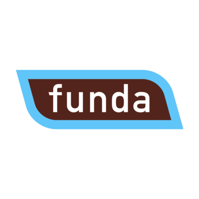
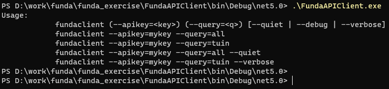

<!--
*** Thanks for checking out the Best-README-Template. If you have a suggestion
*** that would make this better, please fork the repo and create a pull request
*** or simply open an issue with the tag "enhancement".
*** Thanks again! Now go create something AMAZING! :D
***
***
***
*** To avoid retyping too much info. Do a search and replace for the following:
*** github_username, repo_name, twitter_handle, email, project_title, project_description
-->


<!-- PROJECT SHIELDS -->
<!--
*** I'm using markdown "reference style" links for readability.
*** Reference links are enclosed in brackets [ ] instead of parentheses ( ).
*** See the bottom of this document for the declaration of the reference variables
*** for contributors-url, forks-url, etc. This is an optional, concise syntax you may use.
*** https://www.markdownguide.org/basic-syntax/#reference-style-links
-->
[![Contributors][contributors-shield]][contributors-url]
[![Forks][forks-shield]][forks-url]
[![Stargazers][stars-shield]][stars-url]
[![Issues][issues-shield]][issues-url]
[![MIT License][license-shield]][license-url]
[![LinkedIn][linkedin-shield]][linkedin-url]


<!-- PROJECT LOGO -->
<br />
<p align="center">
  <a href="https://github.com/raulcorreia7/Funda_Challenge">
    
  </a>

  <h3 align="center">Funda Challenge</h3>

  <p align="center">
    .NET API Consumption
    <br />
    <a href="https://github.com/raulcorreia7/Funda_Challenge"><strong>Explore the docs »</strong></a>
    <br />
    <!-- <br /> -->
    <!-- <a href="https://github.com/raulcorreia7/Funda_Challenge">View Demo</a>
    · -->
    <a href="https://github.com/raulcorreia7/Funda_Challenge/issues">Report Bug</a>
    ·
    <a href="https://github.com/raulcorreia7/Funda_Challenge/issues">Request Feature</a>
  </p>
</p>


<!-- TABLE OF CONTENTS -->
<details open="open">
  <summary><h2 style="display: inline-block">Table of Contents</h2></summary>
  <ol>
    <li>
      <a href="#about-the-project">About The Project</a>
      <ul>
        <li><a href="#built-with">Built With</a></li>
      </ul>
    </li>
    <li>
      <a href="#getting-started">Getting Started</a>
      <ul>
        <li><a href="#prerequisites">Prerequisites</a></li>
        <li><a href="#installation">Installation</a></li>
      </ul>
    </li>
    <li><a href="#usage">Usage</a></li>
    <!-- <li><a href="#roadmap">Roadmap</a></li>
    <li><a href="#contributing">Contributing</a></li> -->
    <li><a href="#license">License</a></li>
    <li><a href="#contact">Contact</a></li>
    <li><a href="#acknowledgements">Acknowledgements</a></li>
  </ol>
</details>


<!-- ABOUT THE PROJECT -->
## About The Project



Here's a blank template to get started:
**To avoid retyping too much info. Do a search and replace with your text editor for the following:**
`raulcorreia7`, `Funda_Challenge`, `twitter_handle`, `email`, `project_title`, `project_description`


### Built With

* [.NET 5.0](https://dotnet.microsoft.com/download/dotnet/5.0)
* [Visual Studio Code](https://code.visualstudio.com/)
* [Windows Subsystem for Linux](https://docs.microsoft.com/en-us/windows/wsl/install-win10)
* Windows 10


<!-- GETTING STARTED -->
## Getting Started

To get a local copy up and running follow these simple steps.

### Prerequisites

You need the latest .NET 5.0 SDK installation to run this application.
You can run this in Linux or Windows.

### Installation

1. Clone the repo
   ```sh
   git clone https://github.com/raulcorreia7/Funda_Challenge.git
   ```
2. Build the project
   ```sh
   # in root folder of git
    make build
        # or
    dotnet build
   ```
3. Test the project
    ```sh
    # in root folder of git
    make test
        # or
    dotnet test
    ```
4. Run the project
    ```sh
    cd FundaAPIClient

    dotnet run -- --apikey=MYKEY --query=all
    ```
5. Build and test
    ```sh
    # in root folder of git
    make all
    ```

<!-- USAGE EXAMPLES -->
## Usage

```sh
# go to project
cd FundaAPIClient

#run help
dotnet run -- --help
Usage:
            fundaclient (--apikey=<key>) (--query=<q>) [--quiet | --debug | --verbose]
            fundaclient --apikey=mykey --query=all
            fundaclient --apikey=mykey --query=tuin
            fundaclient --apikey=mykey --query=all --quiet
            fundaclient --apikey=mykey --query=tuin --verbose
            
#example:
dotnet run -- --apikey=mykey --query=tuin


```

After running, the results will display in the console output.
All output will be logged where the binaries are located.
example: bin/debug/net5.0/logs
Testing will log with multiple log levels (Information, Debug, Verbose), so if you wish to see what happens behind the scenes, check the Test folder for the same thing.
<!-- _For more examples, please refer to the [Documentation](https://example.com)_ -->


<!-- ROADMAP -->
<!-- ## Roadmap

See the [open issues](https://github.com/raulcorreia7/Funda_Challenge/issues) for a list of proposed features (and known issues). -->


<!-- CONTRIBUTING -->
<!-- ## Contributing

Contributions are what make the open source community such an amazing place to be learn, inspire, and create. Any contributions you make are **greatly appreciated**.

1. Fork the Project
2. Create your Feature Branch (`git checkout -b feature/AmazingFeature`)
3. Commit your Changes (`git commit -m 'Add some AmazingFeature'`)
4. Push to the Branch (`git push origin feature/AmazingFeature`)
5. Open a Pull Request -->


<!-- LICENSE -->
## License

Distributed under the MIT License. See `LICENSE` for more information.


<!-- CONTACT -->
## Contact

Raúl Correia - raulcorreia7@gmail.com

Project Link: [https://github.com/raulcorreia7/Funda_Challenge](https://github.com/raulcorreia7/Funda_Challenge)


<!-- ACKNOWLEDGEMENTS -->
## Acknowledgements

* [Funda](https://www.funda.nl)
* [LinkedIn](https://www.linkedin.com)


<!-- MARKDOWN LINKS & IMAGES -->
<!-- https://www.markdownguide.org/basic-syntax/#reference-style-links -->
[contributors-shield]: https://img.shields.io/github/contributors/raulcorreia7/Funda_Challenge.svg?style=for-the-badge
[contributors-url]: https://github.com/raulcorreia7/Funda_Challenge/graphs/contributors
[forks-shield]: https://img.shields.io/github/forks/raulcorreia7/Funda_Challenge.svg?style=for-the-badge
[forks-url]: https://github.com/raulcorreia7/Funda_Challenge/network/members
[stars-shield]: https://img.shields.io/github/stars/raulcorreia7/Funda_Challenge.svg?style=for-the-badge
[stars-url]: https://github.com/raulcorreia7/Funda_Challenge/stargazers
[issues-shield]: https://img.shields.io/github/issues/raulcorreia7/Funda_Challenge.svg?style=for-the-badge
[issues-url]: https://github.com/raulcorreia7/Funda_Challenge/issues
[license-shield]: https://img.shields.io/github/license/raulcorreia7/Funda_Challenge.svg?style=for-the-badge
[license-url]: https://github.com/raulcorreia7/Funda_Challenge/blob/master/LICENSE.txt
[linkedin-shield]: https://img.shields.io/badge/-LinkedIn-black.svg?style=for-the-badge&logo=linkedin&colorB=555
[linkedin-url]: https://linkedin.com/in/raulcorreia7
